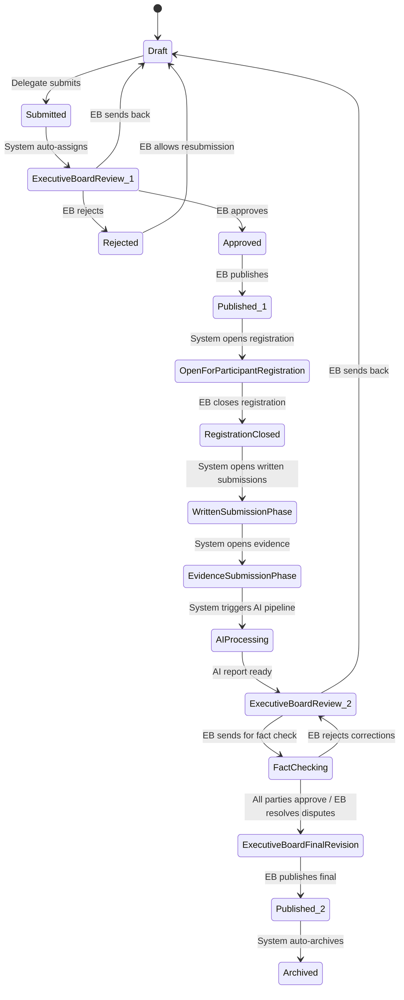

# Phase 2 — Issue Lifecycle

**WTO Digital Dispute Documentation Platform**

- **Document Version:** 2.0
- **Phase:** 2 — Issue State Machine, Issue CRUD, Participant Registration, Dashboard Layout
- **Status:** Approved
- **Target Release:** Sprint 2

---

## Table of Contents

1. [Issue State Machine](#1-issue-state-machine)
2. [State Descriptions](#2-state-descriptions)
3. [Valid Transitions](#3-valid-transitions)
4. [Invalid Transitions](#4-invalid-transitions)
5. [Issue Model](#5-issue-model)
6. [Issue CRUD API](#6-issue-crud-api)
7. [Participant Registration](#7-participant-registration)
8. [Dashboard Layout](#8-dashboard-layout)
9. [Issue List View](#9-issue-list-view)
10. [Issue Detail View](#10-issue-detail-view)
11. [Status Badge System](#11-status-badge-system)
12. [Component Specifications](#12-component-specifications)
13. [Error Handling](#13-error-handling)
14. [Loading and Empty States](#14-loading-and-empty-states)
15. [Acceptance Criteria](#15-acceptance-criteria)

---

## 1. Issue State Machine

### 1.1 Complete State Diagram



### 1.2 State Enum

```typescript
enum IssueStatus {
  DRAFT = 'draft',
  SUBMITTED = 'submitted',
  EXECUTIVE_BOARD_REVIEW = 'executive_board_review',
  REJECTED = 'rejected',
  APPROVED = 'approved',
  PUBLISHED = 'published',
  OPEN_FOR_PARTICIPANT_REGISTRATION = 'open_for_participant_registration',
  REGISTRATION_CLOSED = 'registration_closed',
  WRITTEN_SUBMISSION_PHASE = 'written_submission_phase',
  EVIDENCE_SUBMISSION_PHASE = 'evidence_submission_phase',
  AI_PROCESSING = 'ai_processing',
  FACT_CHECKING = 'fact_checking',
  EXECUTIVE_BOARD_FINAL_REVISION = 'executive_board_final_revision',
  ARCHIVED = 'archived',
}
```

---

## 2. State Descriptions

### 2.1 Draft

The initial state of every issue. Only the complainant delegate has write access. The issue exists as a private working document. No other users can view it. No notifications are sent. No timeline entries are created beyond the creation timestamp.

- **Visibility:** Owner only
- **Editable fields:** Title, Description, Legal Basis, Requested Remedy (any subset)
- **Persistence:** Saved as a record in the issues table with status `draft`. Changes are persisted immediately on save.

### 2.2 Submitted

The complainant has completed the issue form and explicitly submitted it. At this point the issue becomes read-only for the complainant. The system transitions the issue to `executive_board_review` automatically within 30 seconds after submission.

- **Visibility:** Executive Board, Complainant
- **Editable fields:** None
- **Trigger:** Delegate clicks "Submit" from Draft
- **Side effect:** Notification sent to all EB members; timeline entry created

### 2.3 Executive Board Review (1st)

The issue is queued for EB evaluation. EB members review the description, legal basis, and requested remedy. They may approve, reject, or send back to Draft with comments.

- **Visibility:** Executive Board, Complainant
- **Editable fields:** None
- **Duration:** No time limit enforced by the system

### 2.4 Rejected

The EB has determined the issue does not meet procedural requirements. The complainant is notified with a reason. The issue may be sent back to Draft for revision, or rejected permanently (archived).

- **Visibility:** Executive Board, Complainant
- **Read-only:** Yes
- **Side effect:** Rejection reason required; notification sent to complainant

### 2.5 Approved

The EB has approved the issue for publication. This state is brief — the EB almost immediately proceeds to Publish.

- **Visibility:** Executive Board, Complainant
- **Side effect:** Notification sent to all delegates

### 2.6 Published (1st — Issue Announcement)

The issue becomes visible to all delegates. The issue number is now finalized. Other delegates can view the issue details but cannot yet register.

- **Visibility:** All delegates
- **Editable fields:** None
- **Side effect:** Notification sent to all delegates; timeline entry created

### 2.7 Open for Participant Registration

Delegates (other than the complainant) may join the issue as Respondent or Third Party. The complainant is fixed at creation.

- **Visibility:** All delegates
- **Duration:** EB decides when to close
- **Side effect:** Registration buttons appear in UI

### 2.8 Registration Closed

No further participants can join. The participant roster is locked for the remainder of the lifecycle.

- **Side effect:** Participant list finalized; notification to registered participants

### 2.9 Written Submission Phase

Registered participants submit written statements. Each role submits different required fields:

- **Complainant:** Issue Description, Legal Basis, Requested Remedy, Supporting Evidence
- **Respondent:** Defense, Legal Arguments, Requested Outcome, Evidence
- **Third Party:** Trade Interest, Position, Supporting Arguments, Evidence

Participants can edit their submissions until the phase closes.

- **Visibility:** All registered participants, EB
- **Duration:** Determined by EB (not system-enforced)

### 2.10 Evidence Submission Phase

Participants submit supporting evidence documents. Each piece of evidence is a structured record with metadata (title, description, file, type).

- **Visibility:** All registered participants, EB
- **Duration:** Determined by EB

### 2.11 AI Processing

The system triggers the AI pipeline. All submissions and evidence are collected, normalized, and processed. The AI generates a structured panel report. This state is system-controlled; no user actions are possible.

- **Visibility:** EB (processing status shown)
- **Duration:** Variable (background task)

### 2.12 Executive Board Review (2nd — AI Report Review)

EB members review the AI-generated report. They may edit the report, request corrections, send it to fact checking, or send the entire issue back to Draft.

- **Visibility:** Executive Board only

### 2.13 Fact Checking

The AI report is sent to all registered participants. Each participant must either **Approve** the report or **Request Correction**. A correction includes a comment explaining the needed change. Each party must issue a decision before the state can advance. Once all parties have responded, the EB reviews.

- **Visibility:** All registered participants, EB
- **Side effect:** Notifications to all parties when all have responded

### 2.14 Executive Board Final Revision

The EB reviews correction requests from fact checking. The EB may:

- Accept a correction and edit the report
- Reject a correction with justification
- Send the report back for another round of fact checking

Once the EB is satisfied, they publish the final report.

- **Visibility:** Executive Board only

### 2.15 Published (2nd — Final Report)

The final report is published and visible to all delegates. The published report is a snapshot — no further edits allowed.

- **Visibility:** All delegates
- **Side effect:** Notification to all delegates; report stored in published_reports table

### 2.16 Archived

The issue is moved to archival storage after a configurable period (default: 30 days after final publication). Archived issues are read-only and hidden from the default issue list (accessible via a filter toggle).

- **Visibility:** All delegates (with archive toggle)
- **Side effect:** Data moved to cold storage partition (soft delete with flag)

---

## 3. Valid Transitions

### Transition Table

| # | From | To | Triggered By | Required Conditions | Side Effects |
|---|---|---|---|---|---|
| 1 | Draft | Submitted | Delegate (Complainant) | All required fields populated (title, description, legal basis, requested remedy) | Notification to all EB members; timeline entry: "Issue submitted by {delegate}" |
| 2 | Submitted | Executive Board Review | System (automatic) | None (transition occurs 30s after Submission) | Timeline entry: "Issue assigned for EB review" |
| 3 | Executive Board Review | Rejected | EB (any member) | Rejection reason must be non-empty string (min 20 chars) | Notification to complainant; timeline entry: "Issue rejected — {reason}" |
| 4 | Executive Board Review | Approved | EB (any member) | None | Notification to complainant; timeline entry: "Issue approved by EB" |
| 5 | Approved | Published | EB (any member) | None | Issue number finalized (WTO-YYYY-NNNN); notification to all delegates; timeline entry: "Issue published as {issue_number}" |
| 6 | Published | Open for Participant Registration | EB (any member) | None | Registration window opens; timeline entry: "Participant registration opened" |
| 7 | Open for Participant Registration | Registration Closed | EB (any member) | At least complainant registered (always true) | Participant roster locked; notification to registered parties; timeline entry: "Registration closed — {N} participants" |
| 8 | Registration Closed | Written Submission Phase | EB (any member) | At least 2 participants (complainant + respondent) | Submission period opens; notification to all registered participants; timeline entry: "Written submission phase opened" |
| 9 | Written Submission Phase | Evidence Submission Phase | EB (any member) | All registered participants have submitted written statements | Evidence upload opens; notification to all registered participants; timeline entry: "Evidence submission phase opened" |
| 10 | Evidence Submission Phase | AI Processing | EB (any member) | All required evidence fields populated | AI pipeline triggered; timeline entry: "AI processing initiated" |
| 11 | AI Processing | Executive Board Review | System (automatic) | AI pipeline completed successfully | Notification to EB: "AI report ready for review"; timeline entry: "AI report generated" |
| 12 | Executive Board Review | Fact Checking | EB (any member) | None | Report sent to all registered participants; notification: "Fact checking requested"; timeline entry: "Report sent for fact checking" |
| 13 | Executive Board Review | Draft | EB (any member) | EB justification required | Notification to complainant; all submissions preserved; timeline entry: "Issue returned to draft — {reason}" |
| 14 | Fact Checking | Executive Board Final Revision | System (automatic) | All parties have submitted decision (approve or correction_request) | Summary of corrections compiled; notification to EB; timeline entry: "Fact checking complete — {N} corrections requested" |
| 15 | Fact Checking | Executive Board Review | EB (any member) | EB determines a second round of AI review is needed | Timeline entry: "Sent back for EB re-review" |
| 16 | Executive Board Final Revision | Published | EB (any member) | Final report has been reviewed | Final report published; notification to all delegates; timeline entry: "Final report published" |
| 17 | Published | Archived | System (automatic) | 30 days after publication OR EB manually archives | Issue moved to archive; timeline entry: "Issue archived" |
| 18 | Rejected | Draft | EB (any member) | None | Notification to complainant; timeline entry: "Resubmission allowed" |

---

## 4. Invalid Transitions

Any transition not listed in Section 3 is invalid by default. The following invalid transitions are explicitly enforced at the application layer to prevent common mistakes:

| From | To | Why Invalid |
|---|---|---|
| Draft | Published | Skips EB review entirely — bypasses approval process |
| Draft | Open for Participant Registration | Issue must be published first |
| Submitted | Published | EB must explicitly approve first |
| Submitted | Rejected | EB must issue an explicit review decision |
| Approved | Draft | Approval cannot be reversed; only Published can be issued |
| Rejected | Submitted | Must return to Draft first |
| Published | Approved | Cannot go backward from Published |
| Published | Fact Checking | Full lifecycle must be followed through participant registration, submissions, AI processing |
| Open for Participant Registration | Written Submission Phase | Registration must close first |
| Registration Closed | Evidence Submission Phase | Written submissions must be collected first |
| Fact Checking | Draft | Cannot bypass EB review of corrections |
| Fact Checking | Published | Cannot publish without EB final revision |
| Any | Any | Status transitions originating from a delegate who is not EB (except Draft → Submitted by complainant) |

**Enforcement:** The state machine must be validated server-side before any status update. The client should also disable invalid action buttons. The server must reject invalid transitions with HTTP 422 and a descriptive error message.

---

## 5. Issue Model

### 5.1 Database Schema

```sql
CREATE TABLE issues (
    id UUID PRIMARY KEY DEFAULT gen_random_uuid(),
    issue_number TEXT UNIQUE, -- format: WTO-YYYY-NNNN, set on first publish
    title TEXT NOT NULL CHECK (char_length(title) >= 10 AND char_length(title) <= 200),
    description TEXT NOT NULL CHECK (char_length(description) >= 50 AND char_length(description) <= 5000),
    legal_basis TEXT, -- JSON array of treaty references
    requested_remedy TEXT, -- JSON structure
    status IssueStatus NOT NULL DEFAULT 'draft',
    complainant_id UUID NOT NULL REFERENCES users(id),
    rejection_reason TEXT,
    created_at TIMESTAMPTZ NOT NULL DEFAULT now(),
    updated_at TIMESTAMPTZ NOT NULL DEFAULT now(),
    published_at TIMESTAMPTZ,
    archived_at TIMESTAMPTZ,
    current_revision_id UUID REFERENCES revisions(id),
    metadata JSONB DEFAULT '{}' -- flexible extension point
);

CREATE INDEX idx_issues_status ON issues(status);
CREATE INDEX idx_issues_complainant ON issues(complainant_id);
CREATE INDEX idx_issues_issue_number ON issues(issue_number);
CREATE INDEX idx_issues_created_at ON issues(created_at DESC);
CREATE INDEX idx_issues_search ON issues USING gin(to_tsvector('english', title || ' ' || description));
```

### 5.2 Field Descriptions

| Field | Type | Description |
|---|---|---|
| id | UUID | Primary key, generated server-side |
| issue_number | TEXT | Nullable until first publish. Format: `WTO-YYYY-NNNN` where YYYY is the current year and NNNN is a zero-padded sequential counter per year. Reset each year. Generated by a database function or application service. |
| title | TEXT | Short descriptive title of the dispute. 10–200 characters. |
| description | TEXT | Full description of the dispute. 50–5000 characters. |
| legal_basis | TEXT | JSON array of references to WTO agreements, articles, and precedents. Example: `[{"agreement":"GATT 1994","article":"Article I","text":"Most-Favoured-Nation Treatment"}]` |
| requested_remedy | TEXT | JSON array describing the remedy sought. Example: `[{"type":"compensation","description":"Tariff reduction of 5%"}]` |
| status | IssueStatus | Current state in the state machine. |
| complainant_id | UUID | The delegate who created the issue. Immutable after submission. |
| rejection_reason | TEXT | Populated when EB rejects the issue. Nullable. |
| created_at | TIMESTAMPTZ | Timestamp of initial draft creation. |
| updated_at | TIMESTAMPTZ | Timestamp of last status change or field edit. |
| published_at | TIMESTAMPTZ | Timestamp when issue was first published (announcement). |
| archived_at | TIMESTAMPTZ | Timestamp when issue was archived. |

### 5.3 Related Tables

#### 5.3.1 Participants

```sql
CREATE TABLE participants (
  id UUID PRIMARY KEY DEFAULT gen_random_uuid(),
  issue_id UUID NOT NULL REFERENCES issues(id) ON DELETE CASCADE,
  user_id UUID NOT NULL REFERENCES users(id) ON DELETE CASCADE,
  role ParticipantRole NOT NULL, -- 'complainant', 'respondent', 'third_party'
  joined_at TIMESTAMPTZ NOT NULL DEFAULT now(),
  role_locked BOOLEAN NOT NULL DEFAULT true,
  UNIQUE(issue_id, user_id)
);

CREATE INDEX idx_participants_issue ON participants(issue_id);
CREATE INDEX idx_participants_user ON participants(user_id);
```

#### 5.3.2 Timeline Events

```sql
CREATE TABLE timeline_events (
  id UUID PRIMARY KEY DEFAULT gen_random_uuid(),
  issue_id UUID NOT NULL REFERENCES issues(id) ON DELETE CASCADE,
  event_type TEXT NOT NULL,
  description TEXT NOT NULL,
  actor_id UUID REFERENCES users(id),
  metadata JSONB DEFAULT '{}',
  created_at TIMESTAMPTZ NOT NULL DEFAULT now()
);

CREATE INDEX idx_timeline_issue ON timeline_events(issue_id, created_at DESC);
```

#### 5.3.3 Submissions

```sql
CREATE TABLE submissions (
  id UUID PRIMARY KEY DEFAULT gen_random_uuid(),
  issue_id UUID NOT NULL REFERENCES issues(id) ON DELETE CASCADE,
  participant_id UUID NOT NULL REFERENCES participants(id) ON DELETE CASCADE,
  submission_type TEXT NOT NULL, -- 'written_statement', 'evidence'
  content JSONB NOT NULL,
  created_at TIMESTAMPTZ NOT NULL DEFAULT now(),
  updated_at TIMESTAMPTZ NOT NULL DEFAULT now(),
  revision_number INT NOT NULL DEFAULT 1,
  UNIQUE(participant_id, submission_type, revision_number)
);
```

#### 5.3.4 Revisions

```sql
CREATE TABLE revisions (
  id UUID PRIMARY KEY DEFAULT gen_random_uuid(),
  issue_id UUID NOT NULL REFERENCES issues(id) ON DELETE CASCADE,
  revision_number INT NOT NULL,
  changes JSONB NOT NULL,
  created_by UUID NOT NULL REFERENCES users(id),
  created_at TIMESTAMPTZ NOT NULL DEFAULT now(),
  UNIQUE(issue_id, revision_number)
);
```

### 5.4 Issue Number Generation

Issue numbers follow the format `WTO-YYYY-NNNN` where:

- **YYYY:** Current year (e.g., 2026)
- **NNNN:** Zero-padded sequential number, reset annually (0001, 0002, ..., 9999)

The counter is stored in a separate table `issue_number_sequences` to avoid lock contention on the issues table:

```sql
CREATE TABLE issue_number_sequences (
  year INT NOT NULL,
  current_sequence INT NOT NULL DEFAULT 0,
  PRIMARY KEY (year)
);
```

**Generation function** must:
1. Obtain a row-level lock on the sequence row for the current year
2. Increment the counter atomically
3. Return the formatted string
4. Assign to `issue_number` on the issues row

If no row exists for the current year, insert one with sequence 0.

---

## 6. Issue CRUD API

### 6.1 Endpoints

All endpoints are prefixed with `/api/v1`.

#### 6.1.1 Create Issue Draft

```
POST /issues
```

- **Auth required:** Yes (Delegate)
- **Request body:**

```json
{
  "title": "string (10-200 chars)",
  "description": "string (50-5000 chars)",
  "legal_basis": "string (optional, JSON array)",
  "requested_remedy": "string (optional, JSON array)"
}
```

- **Response:** `201 Created`

```json
{
  "id": "uuid",
  "title": "...",
  "description": "...",
  "status": "draft",
  "complainant": { "id": "uuid", "display_name": "..." },
  "created_at": "ISO8601"
}
```

- **Validation errors:** `422 Unprocessable Entity` with field-level error messages.

#### 6.1.2 Update Issue Draft

```
PATCH /issues/{issue_id}
```

- **Auth required:** Yes (Complainant only)
- **Conditions:** Status must be `draft`. Only the owner may update.
- **Request body:** Partial update with same fields as create. Only provided fields are updated.
- **Response:** `200 OK` with updated issue object.

#### 6.1.3 Submit Issue

```
POST /issues/{issue_id}/submit
```

- **Auth required:** Yes (Complainant only)
- **Conditions:** Status must be `draft`. Title and description must be populated (legal_basis and requested_remedy are optional but recommended).
- **Response:** `200 OK` with status changed to `draft`.

```json
{
  "status": "submitted",
  "scheduled_review_at": "ISO8601 (30s from now)"
}
```

#### 6.1.4 Get Issue

```
GET /issues/{issue_id}
```

- **Auth required:** Yes
- **Authorization:**
  - Draft: Only complainant and EB
  - Submitted → Executive Board Review: Complainant and EB
  - Published onward: All delegates
- **Response:** `200 OK` with full issue object including participants, timeline (paginated), and status.

#### 6.1.5 List Issues

```
GET /issues
```

- **Auth required:** Yes
- **Query parameters:**

| Parameter | Type | Default | Description |
|---|---|---|---|
| `status` | string | `all` | Filter by status (comma-separated for multiple) |
| `search` | string | — | Full-text search on title and description |
| `page` | int | 1 | Page number (1-indexed) |
| `page_size` | int | 20 | Items per page (max 100) |
| `sort` | string | `created_at` | Sort field |
| `order` | string | `desc` | Ascending or descending |
| `role` | string | — | Filter by user's role in the issue (complainant/respondent/third_party) |
| `participant_id` | UUID | — | Filter by delegate's participation |

- **Response:** `200 OK`

```json
{
  "data": [ ... ],
  "pagination": {
    "page": 1,
    "page_size": 20,
    "total_items": 142,
    "total_pages": 8
  }
}
```

#### 6.1.6 Transition Issue Status

```
PATCH /issues/{issue_id}/status
```

- **Auth required:** Yes (EB for most transitions; Complainant for Draft → Submitted)
- **Request body:**

```json
{
  "status": "submitted",
  "reason": "string (required for rejection transitions)"
}
```

- **Response:** `200 OK` with updated issue object including new status and timeline entry.
- **Error responses:**
  - `403 Forbidden` — User lacks permission for this transition
  - `422 Unprocessable Entity` — Invalid transition or missing required fields

#### 6.1.7 Get Issue Timeline

```
GET /issues/{issue_id}/timeline
```

- **Auth required:** Yes
- **Query parameters:** `page`, `page_size`
- **Response:** `200 OK` with paginated array of timeline events.

#### 6.1.8 Get Issue Participants

```
GET /issues/{issue_id}/participants
```

- **Auth required:** Yes
- **Response:** `200 OK`

```json
{
  "complainant": { ... },
  "respondent": { ... },
  "third_parties": [ ... ]
}
```

### 6.2 Pagination Contract

Every paginated endpoint returns:

```json
{
  "data": [],
  "pagination": {
    "page": 1,
    "page_size": 20,
    "total_items": 0,
    "total_pages": 0
  }
}
```

### 6.3 Error Response Contract

All error responses follow this format:

```json
{
  "error": {
    "code": "INVALID_TRANSITION",
    "message": "Cannot transition from 'published' to 'draft'",
    "details": {
      "from": "published",
      "to": "draft"
    }
  }
}
```

---

## 7. Participant Registration

### 7.1 Flow Overview

```
Open for Registration ──> Delegate selects role ──> System validates ──> Enters UNIQUE(issue, user) ──> Role locked
```

The registration flow is a single-step process. The delegate selects their role (Respondent or Third Party) and the system creates a participant record instantly.

### 7.2 Registration Rules

| Rule | Implementation |
|---|---|
| Complainant is fixed at creation | Set via `complainant_id` on issues table. Cannot be changed through participant registration. |
| Each delegate can have only one role per issue | Enforced by `UNIQUE(issue_id, user_id)` constraint on participants table. |
| Role is locked on assignment | `role_locked` column set to `true`. EB may change role via `PATCH /issues/{issue_id}/participants/{participant_id}` (requires EB auth and approval_reason). |
| Registration only during Open phase | Server validates `status = open_for_participant_registration` before allowing any registration action. |
| No limit on Third Parties | System allows unlimited Third Party participants. |
| Role labels | Displayed as "Complainant", "Respondent", "Third Party" in UI. |

### 7.3 API Endpoints

#### 7.3.1 Register as Participant

```
POST /issues/{issue_id}/participants
```

- **Auth required:** Yes (Delegate)
- **Request body:**

```json
{
  "role": "respondent"
}
```

- **Valid roles:** `respondent`, `third_party` (not `complainant`)
- **Response:** `201 Created`

```json
{
  "id": "uuid",
  "issue_id": "uuid",
  "user_id": "uuid",
  "role": "respondent",
  "role_locked": true,
  "joined_at": "ISO8601"
}
```

- **Error responses:**
  - `409 Conflict` — User already registered for this issue
  - `422 Unprocessable Entity` — Invalid role or registration phase not open
  - `403 Forbidden` — User is the complainant (cannot re-register)

#### 7.3.2 Change Participant Role (EB only)

```
PATCH /issues/{issue_id}/participants/{participant_id}
```

- **Auth required:** Yes (EB only)
- **Request body:**

```json
{
  "role": "third_party",
  "reason": "Role was incorrectly assigned"
}
```

- **Response:** `200 OK`

### 7.4 Participant Registration UI

The registration component is a modal triggered from the issue detail page when the issue status is `open_for_participant_registration`.

**Modal states:**

| State | Display |
|---|---|
| Not registered | "Join this issue" button → Role selection radio (Respondent / Third Party) → Confirm |
| Already registered | "You are registered as {Role}" with disabled badge |
| Registration closed | No registration UI shown; existing participants displayed in read-only list |
| Loading | Skeleton of the registration card |
| Error | Error banner with retry button |

### 7.5 Participant Display

On the issue detail page, participants are displayed in a dedicated section:

```
┌─────────────────────────────────────┐
│ Participants                        │
│                                     │
│ Complainant                         │
│   Delegate: France (Alex R.)       │
│                                     │
│ Respondent                          │
│   Delegate: Brazil (Maria S.)         │
│                                     │
│ Third Parties (3)                   │
│   Delegate: India (Raj P.)          │
│   Delegate: Japan (Yuki T.)         │
│   Delegate: Canada (Sam L.)         │
└─────────────────────────────────────┘
```

---

## 8. Dashboard Layout

### 8.1 Layout Structure

```
┌─────────────┬────────────────────────────────────────────────────┐
│             │                                                    │
│   Sidebar   │               Content Area                         │
│   (240px)   │                                                    │
│             │     ┌────────────────────────────────────────┐      │
│   Logo      │     │  Topbar (64px)                        │      │
│             │     │  [Breadcrumb]            [Profile]    │      │
│   Nav       │     └────────────────────────────────────────┘      │
│   Items     │                                                    │
│   (max 5)   │     ┌────────────────────────────────────────┐      │
│             │     │  Page Content                            │      │
│   [User]    │     │                                          │      │
│             │     │  (Fills remaining vertical space)        │      │
│             │     │                                          │      │
│             │     └────────────────────────────────────────┘      │
│             │                                                    │
└─────────────┴──────────────────────────────────────────────────────┘
```

### 8.2 Sidebar

**Width:** 240px fixed

**Background:** `bg-secondary` (#0B2345)

**Border:** Right border using `border-subtle` (rgba(255,255,255,0.08))

**Contents (top to bottom):**

1. **Logo zone** — 64px height. Application logo/name "WTO DSB Platform". Uses `heading` weight (700) with `text-primary`.

2. **Navigation items** — Max 5 items. Each item is a `NavItem` component:
   - Home / Dashboard
   - Issues (with count badge)
   - My Issues
   - Users / Directory (EB only)
   - Settings

3. **Active indicator** — 3px accent bar on the left side of the active nav item, using `accent-primary`.

4. **Spacing** — 24px (`md`) between nav items.

5. **User zone** — Bottom-aligned. Shows current user avatar, display name, role badge, and logout link. Separated from nav by a `border-subtle` divider.

**State:** The sidebar is persistent across all authenticated pages within the dashboard. It is hidden on unauthenticated pages (login, public issue view).

### 8.3 Topbar

**Height:** 64px

**Background:** `bg-elevated` (#112F5A)

**Border:** Bottom `border-subtle`

**Contents:**

| Left | Center | Right |
|---|---|---|
| Breadcrumb navigation (e.g., Issues > Issue Number > Detail) | — | User profile avatar + dropdown |

**Breadcrumb:** Uses `text-muted` for non-active segments, `text-primary` for the current page. Separator: `/` in `text-muted`.

### 8.4 Content Area

**Background:** `bg-primary` (#05162D)

**Max width:** 1200px (`contentWidth`)

**Padding:** `lg` (40px) horizontal, `md` (24px) vertical

**Scroll:** Full-page scroll (body scroll, not nested scroll areas)

### 8.5 Responsive Behavior

| Breakpoint | Sidebar | Content Area |
|---|---|---|
| ≥ 1200px | Visible, 240px | 1200px max-width, centered |
| 768px–1199px | Visible, collapsed icons only (64px) | Remaining width |
| < 768px | Hidden, hamburger toggle | Full width, padding 24px |

---

## 9. Issue List View

### 9.1 Component Layout

```
┌─────────────────────────────────────────────────────────────────────┐
│  Issues [Count]                                      [+ New Issue]  │
│                                                                     │
│  ┌──────────────────────────────────────────────────────────────┐   │
│  │  [Search input]          [Status filter ▼] [Sort ▼]        │   │
│  └──────────────────────────────────────────────────────────────┘   │
│                                                                     │
│  ┌──────────────────────────────────────────────────────────────┐   │
│  │ Status Badge │ WTO-2026-0001 │ Title...    │ 2 days ago  → │   │
│  ├──────────────────────────────────────────────────────────────┤   │
│  │ Status Badge │ WTO-2026-0002 │ Title...    │ 5 days ago  → │   │
│  ├──────────────────────────────────────────────────────────────┤   │
│  │ ...                                                          │   │
│  └──────────────────────────────────────────────────────────────┘   │
│                                                                     │
│  [◄ 1  2  3 ... 10 ►]                                              │
└─────────────────────────────────────────────────────────────────────┘
```

### 9.2 Search and Filters

#### 9.2.1 Search Input

- Full-text search across `title` and `description`.
- Debounced: 300ms delay after user stops typing before sending API request.
- Minimum query length: 2 characters.
- Placeholder text: "Search disputes..."
- Icon: Search (magnifying glass) from lucide-react.

#### 9.2.2 Status Filter

- Dropdown multi-select component.
- Options map to each `IssueStatus` value.
- Label: "Status" with count of active filters.
- Default: No filter (shows all non-archived).

#### 9.2.3 Sort

- Dropdown single-select.
- Options:
  - Newest First (default)
  - Oldest First
  - Title A–Z
  - Title Z–A
  - Status

### 9.3 Issue Row

Each row in the issue list renders the `IssueRow` component with:

| Element | Specification |
|---|---|
| Status Badge | Colored badge (see Section 11) |
| Issue Number | Monospace font, `text-muted`, width-120px fixed |
| Title | `text-primary`, truncated to 1 line with ellipsis |
| Participants | Small avatars of complainant + respondent (optional, max 2 shown) |
| Time | Relative time ("2 hours ago", "5 days ago") in `text-muted` |
| Chevron | Right arrow (`→`) indicating clickable row |

**Row height:** 64px (`--spacing-xl`)

**Row hover:** `background: bg-elevated` (#112F5A)

**Row click:** Navigate to issue detail page (`/issues/{issue_id}`)

### 9.4 Empty State

When no issues match the current filters:

```
┌─────────────────────────────────────────────┐
│  📋 No disputes found                         │
│                                               │
│  Try adjusting your filters or search query.   │
│                                               │
│  [Create First Issue] ───┐                       │
│                        │ (only if no filters active) │
└─────────────────────────────────────────────┘
```

Icon: Clipboard (lucide `clipboard-list`), 48px, `text-muted`.

### 9.5 Loading State

- Skeleton rows: 5 rows of animated placeholder rectangles matching the issue row layout.
- Pulse animation using Tailwind `animate-pulse`.
- Background color: `bg-elevated` with opacity.

---

## 10. Issue Detail View

### 10.1 Layout

```
┌─────────────────────────────────────────────────────────────────────┐
│  [← Back to Issues]                                                │
│                                                                     │
│  ┌──────────────────────────────────────┐  ┌────────────────────┐  │
│  │  Issue Header                         │  │  Metadata Panel    │  │
│  │  [Status Badge] WTO-2026-0001        │  │                    │  │
│  │                                      │  │  Status: Submitted  │  │
│  │  Title                                │  │  Filed: Jan 15     │  │
│  │                                                                  │
│  │                                      │  │  Participants:      │  │
│  │  Description                         │  │  Complainant: FR    │  │
│  │                                      │  │  Respondent: BR     │  │
│  └──────────────────────────────────────┘  └────────────────────┘  │
│                                                                     │
│  ┌──────────────────────────────────────────────────────────────┐   │
│  │  Timeline                                                     │   │
│  │                                                               │   │
│  │  ● ─── to ─── ─── to ─── ─── to ─── ─── to ─── ──►          │   │
│  │  │  [Event icons] [Event description] [Timestamp]              │   │
│  │  │  [Event icons] [Event description] [Timestamp]              │   │
│  │  │  [Event icons] [Event description] [Timestamp]            │   │
│  └──────────────────────────────────────────────────────────────┘   │
└─────────────────────────────────────────────────────────────────────┘
```

### 10.2 Issue Header

- **Back link:** `< Back to Issues` — navigates to issue list. Uses `text-muted`, hover to `accent-secondary`.
- **Status badge:** Large variant (32px height). Uses status color mapping.
- **Issue number:** Monospace, `text-secondary`, font size 14px.
- **Title:** Display weight (800px), `text-primary`, font size 28px (or 2rem).
- **Description:** Body weight, `text-secondary`, max-width 800px.

### 10.3 Metadata Panel

Positioned to the right of the header on screens ≥ 1024px. Below on smaller screens.

**Width:** 320px fixed.

**Contents:**
- **Status** — current status with descriptive label.
- **Filed date** — `issued_at` formatted as "MMM DD, YYYY".
- **Participants** — grouped by role. Each participant shows flag emoji (if available), delegate name, and country.
- **Timeline progress** — Small horizontal progress bar showing position in the lifecycle (percent complete).

### 10.4 Timeline Component

The timeline displays all `timeline_events` for the issue in reverse chronological order.

**Visual design:**
- Vertical line on the left side (`border-subtle`, 2px width).
- Event nodes: 12px circles on the vertical line.
- Active event: filled with `accent-primary`.
- Past events: filled with `border-strong`.
- Future events: outlined with `border-subtle`.

**Each timeline entry shows:**

| Element | Detail |
|---|---|
| Icon | Material-symbol-style icon representing the event type |
| Title | Event type name (e.g., "Issue Submitted") |
| Description | Detail text (e.g., "Submitted by France (Alex R.)") |
| Actor | Delegate name who triggered the event |
| Timestamp | Absolute timestamp in format "MMM DD, YYYY HH:MM UTC" |

**Empty timeline:** Display "No events recorded yet" with a muted icon.

### 10.5 State-Action Panel

Below the metadata panel, display primary action buttons based on the current status and user role:

| Status | User Role | Available Actions |
|---|---|---|
| Draft | Complainant | Submit, Edit Draft, Delete Draft |
| Submitted | Complainant | Awaiting Review |
| Submitted | EB | Review (open review modal) |
| Executive Board Review | EB | Approve, Reject, Send to Draft |
| Approved | EB | Publish |
| Published | EB | Open Registration |
| Open for Participant Registration | Delegate (not registered) | Register as Respondent, Register as Third Party |
| Open for Participant Registration | EB | Close Registration |
| Registration Closed | EB | Open Written Submissions |
| Written Submission Phase | Registered Participant | Submit Written Statement |
| Written Submission Phase | EB | Open Evidence Phase |
| Evidence Submission Phase | Registered Participant | Submit Evidence |
| Evidence Submission Phase | EB | Trigger AI Processing |
| AI Processing | EB | View Processing Status |
| Executive Board Review (AI) | EB | Send to Fact Checking, Send to Draft |
| Fact Checking | Registered Participant | Approve Report, Request Correction |
| Fact Checking | EB | View Progress |
| Executive Board Final Revision | EB | Publish Final Report |
| Published (Final) | All | View Report |
| Archived | All | View Report |

---

## 11. Status Badge System

### 11.1 Color Mapping

Each issue status maps to a distinct color combination. Badges use a filled pill shape with rounded corners (`radius: sm` = 8px).

| Status | Background | Text | Border |
|---|---|---|---|
| Draft | `rgba(255,255,255,0.06)` | `#B6C3D1` | `rgba(255,255,255,0.08)` |
| Submitted | `rgba(30,111,232,0.12)` | `#6CA9FF` | `rgba(30,111,232,0.20)` |
| Executive Board Review | `rgba(108,169,255,0.12)` | `#6CA9FF` | `rgba(108,169,255,0.20)` |
| Rejected | `rgba(239,68,68,0.12)` | `#EF4444` | `rgba(239,68,68,0.20)` |
| Approved | `rgba(34,197,94,0.12)` | `#22C55E` | `rgba(34,197,94,0.20)` |
| Published | `rgba(34,197,94,0.16)` | `#22C55E` | `rgba(34,197,94,0.24)` |
| Open for Participant Registration | `rgba(250,204,21,0.12)` | `#FACC15` | `rgba(250,204,21,0.20)` |
| Registration Closed | `rgba(255,255,255,0.06)` | `#B6C3D1` | `rgba(255,255,255,0.08)` |
| Written Submission Phase | `rgba(108,169,255,0.12)` | `#6CA9FF` | `rgba(108,169,255,0.20)` |
| Evidence Submission Phase | `rgba(108,169,255,0.12)` | `#6CA9FF` | `rgba(108,169,255,0.20)` |
| AI Processing | `rgba(168,85,247,0.12)` | `#A855F7` | `rgba(168,85,247,0.20)` |
| Fact Checking | `rgba(250,204,21,0.12)` | `#FACC15` | `rgba(250,204,21,0.20)` |
| Executive Board Final Revision | `rgba(108,169,255,0.12)` | `#6CA9FF` | `rgba(108,169,255,0.20)` |
| Archived | `rgba(255,255,255,0.06)` | `#7D8DA0` | `rgba(255,255,255,0.08)` |

### 11.2 Badge Variants

| Variant | Height | Font Size | Padding Horizontal | Use Case |
|---|---|---|---|---|
| `sm` | 20px | 11px | 8px (xs) | Inline, card summaries |
| `md` | 24px | 12px | 12px (sm) | Issue list rows |
| `lg` | 32px | 14px | 16px (md) | Issue detail header |

### 11.3 Badge Component

```tsx
interface StatusBadgeProps {
  status: IssueStatus;
  variant?: 'sm' | 'md' | 'lg';
  showLabel?: boolean;
}
```

The `showLabel` property controls whether the label text is shown. When `false`, only the colored dot indicator is displayed (for compact layouts).

---

## 12. Component List

### 12.1 Component Hierarchy

```
AppLayout
├── Sidebar
│   ├── Logo
│   ├── NavItem (× 5 max)
│   └── UserZone
│       ├── Avatar
│       ├── DisplayName
│       ├── RoleBadge
│       └── LogoutButton
├── Topbar
│   ├── Breadcrumb
│   └── UserProfileDropdown
└── ContentArea
    ├── IssueListView
    │   ├── PageHeader (title + action button)
    │   ├── SearchBar
    │   ├── FilterBar
    │   │   ├── StatusFilter (multi-select)
    │   │   └── SortDropdown
    │   ├── IssueRow (× N)
    │   │   ├── StatusBadge
    │   │   ├── IssueNumber
    │   │   ├── IssueTitle
    │   │   ├── ParticipantAvatars
    │   │   └── Timestamp
    │   ├── Pagination
    │   └── EmptyState
    └── IssueDetailView
        ├── IssueHeader
        │   ├── BackLink
        │   ├── StatusBadge
        │   └── IssueNumber
        ├── MetadataPanel
        │   ├── StatusInfo
        │   ├── DateInfo
        │   ├── ParticipantsSection
        │   │   └── ParticipantCard (× N)
        │   └── ProgressBar
        ├── Timeline
        │   ├── TimelineLine
        │   ├── TimelineEvent (× N)
        │   └── EmptyTimeline
        ├── ActionPanel
        │   └── ActionButton (× N, context-dependent)
        └── RoleRegistrationModal
            ├── RoleSelector
            └── ConfirmButton
```

### 12.2 Component Props

#### AppLayout

```tsx
interface AppLayoutProps {
  children: ReactNode;
  requireAuth?: boolean;
  showSidebar?: boolean;
}
```

#### Sidebar

```tsx
interface SidebarProps {
  isCollapsed?: boolean;
  onToggle?: () => void;
}
```

#### NavItem

```tsx
interface NavItemProps {
  label: string;
  icon: LucideIcon;
  href: string;
  isActive: boolean;
  badge?: number;
}
```

#### IssueRow

```tsx
interface IssueRowProps {
  issue: { /* IssueSummary — subset of Issue fields */ };
  onSelect: (id: string) => void;
}
```

#### StatusBadge

```tsx
interface StatusBadgeProps {
  status: IssueStatus;
  variant?: 'sm' | 'md' | 'lg';
}
```

#### TimelineEvent

```tsx
interface TimelineEventProps {
  event: {
    id: string;
    event_type: string;
    description: string;
    actor_name: string;
    created_at: string;
    metadata: Record<string, unknown>;
  };
  isActive?: boolean;
}
```

#### ParticipantCard

```tsx
interface ParticipantCardProps {
  user: {
    id: string;
    display_name: string;
    country: string;
    avatar_url?: string;
  };
  role: 'complainant' | 'respondent' | 'third_party';
}
```

#### ActionButton

```tsx
interface ActionButtonProps {
  label: string;
  variant: 'primary' | 'secondary' | 'danger';
  onClick: () => void;
  disabled?: boolean;
  loading?: boolean;
}
```

#### Pagination

```tsx
interface PaginationProps {
  page: number;
  totalPages: number;
  onPageChange: (page: number) => void;
}
```

#### SearchBar

```tsx
interface SearchBarProps {
  value: string;
  onChange: (value: string) => void;
  placeholder?: string;
}
```

#### StatusFilter

```tsx
interface StatusFilterProps {
  selected: IssueStatus[];
  onChange: (selected: IssueStatus[]) => void;
}
```

---

## 13. Error Handling

### 13.1 Error Categories

| Category | HTTP Status | Client Behavior |
|---|---|---|
| Validation | 422 | Show inline field errors on forms |
| Authorization | 403 | Redirect to login or show "Access denied" |
| Not Found | 404 | Show "Issue not found" page |
| Conflict | 409 | Show "Already registered" toast |
| Invalid Transition | 422 | Show error toast with explanation |
| Server Error | 500 | Show generic error page with "Try again" |
| Rate Limit | 429 | Show "Too many requests. Please wait." |

### 13.2 Client-Side Error Boundaries

- **Page-level:** Each route segment wraps content in an `ErrorBoundary` component that catches render errors and displays a fallback UI with a "Reload" button.
- **Component-level:** Critical components (IssueList, Timeline, ParticipantSection) are individually wrapped to prevent a single component failure from crashing the entire page.

### 13.3 Server Response Format

All server errors follow the contract defined in 6.3. The client error handler parses the response and maps it to the appropriate category:

```typescript
function handleApiError(error: ApiError): { message: string; type: ErrorType } {
  switch (error.code) {
    case 'INVALID_TRANSITION': return { message: `Cannot ${error.details.from} → ${error.details.to}`, type: 'warning' };
    case 'NOT_FOUND': return { message: 'Issue not found', type: 'info' };
    // ...
  }
}
```

### 13.4 Retry Logic

TanStack Query's built-in retry mechanism handles transient failures:

| Condition | Behavior |
|---|---|
| Network error | Retry 3 times with exponential backoff (1s, 2s, 4s) |
| 5xx server error | Retry 3 times with exponential backoff |
| 4xx client error | No retry (immediate error) |
| 429 rate limit | Retry after `Retry-After` header value |

---

## 14. Loading and Empty States

### 14.1 Page-Level Loading

| Component | Loading State |
|---|---|
| Issue List | 8 skeleton rows with pulse animation |
| Issue Detail | Full-page skeleton with header skeleton, metadata skeleton, and timeline skeleton (5 events) |
| Timeline | 5 skeleton event rows |
| Participants | 3 skeleton participant cards |
| Dashboard | Skeleton sidebar + skeleton content area |

### 14.2 Empty States

| Component | Empty State |
|---|---|
| Issue List (no filter) | "No disputes yet. Create the first issue." with CTA button |
| Issue List (with filter) | "No disputes match these filters." with "Clear Filters" button |
| Timeline | "No events recorded yet." |
| Participants (before registration) | "No participants yet. Registration opens soon." |
| Submissions | "No submissions have been filed yet." |
| Search results | "No results found for '{query}'." |

### 14.3 Optimistic Updates

For the following operations, the UI immediately reflects the expected change before the server confirms:

| Operation | Optimistic UI | Rollback |
|---|---|---|
| Status change | Move status badge to new state, insert timeline entry | Revert status badge, show error toast, refetch |
| Participant registration | Add participant card to list (disabled state) | Remove participant card, show error toast |
| Issue creation | Navigate to new issue detail (draft state) | Redirect to list with error toast |
| Issue edit | Update displayed fields immediately | Revert fields, show error toast |

---

## 15. Acceptance Criteria

### 15.1 State Machine

- [ ] All 14 states are defined as an enum and stored in the database.
- [ ] Each valid transition is enforced server-side with a state machine validation function.
- [ ] Invalid transitions return 422 with a descriptive error message.
- [ ] All 18 valid transitions produce a timeline event.
- [ ] State transitions are atomic (database transaction wraps status change + timeline insert).
- [ ] The state machine validates the user's role before allowing a transition.
- [ ] The 30-second auto-transition from Submitted → Executive Board Review fires reliably.
- [ ] Rejection transitions require a non-empty reason.
- [ ] The AI Processing → Executive Board Review transition only fires on pipeline completion.

### 15.2 Issue CRUD

- [ ] Delegates can create, edit, and submit issues in Draft state.
- [ ] Submitted issues become read-only for the complainant.
- [ ] Issue number is generated on first publish in the format WTO-YYYY-NNNN.
- [ ] Issue numbers reset annually (counter starts at 0001 each year).
- [ ] The issue list endpoint supports pagination, filtering, sorting, and searching.
- [ ] The issue detail endpoint returns participants, timeline, and current status.
- [ ] Authorization rules are enforced per status (Draft hidden from non-owners).

### 15.3 Participant Registration

- [ ] Delegates can register as Respondent or Third Party during the Open phase.
- [ ] The complainant is automatically registered at creation and cannot change role.
- [ ] A delegate can only hold one role per issue (enforced by unique constraint).
- [ ] Registration is blocked outside the Open phase (422 returned).
- [ ] Role changes require EB approval and a reason.
- [ ] Registered participants are displayed grouped by role on the issue detail page.

### 15.4 Dashboard and UI

- [ ] Sidebar displays max 5 navigation items.
- [ ] Active nav item shows 2px accent indicator on the left.
- [ ] Topbar shows breadcrumb navigation and user profile.
- [ ] Issue list displays status badges, issue numbers, titles, and timestamps.
- [ ] Search debounces input by 300ms before firing API request.
- [ ] Status filter supports multi-select.
- [ ] Issue rows are clickable and navigate to the detail view.
- [ ] Issue detail view shows header, metadata panel, timeline, and context actions.
- [ ] Timeline displays all events in reverse chronological order.
- [ ] Status badges use the color mapping in Section 11.
- [ ] Loading states show skeleton components with pulse animation.
- [ ] Empty states display contextual messages and actionable CTAs.
- [ ] Error boundaries prevent full-page crashes.
- [ ] Progressive enhancement: all actions available via API (not just UI).
- [ ] Animations respect `prefers-reduced-motion`.